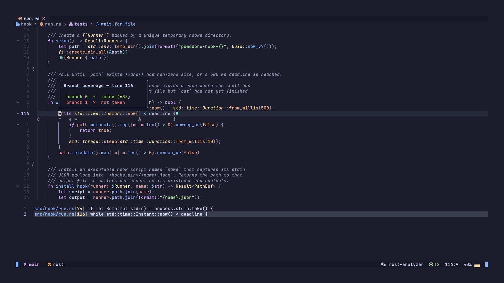

# nvim-coverage

> A Neovim plugin that displays code coverage from [lcov](http://ltp.sourceforge.net/coverage/lcov/geninfo.1.php) files directly in the editor — sign column markers, highlight groups, a summary popup, virtual text hit counts, branch overlays, and quickfix/loclist navigation.

[](https://github.com/nvim-contrib/nvim-coverage/actions/workflows/test.yml)
[](https://github.com/nvim-contrib/nvim-coverage/releases)
[](LICENSE)
[](https://neovim.io)

> Built on the foundation of [andythigpen/nvim-coverage](https://github.com/andythigpen/nvim-coverage), stripped down and focused exclusively on lcov.

## Features

- Sign column markers for covered, uncovered, and partially covered lines
- Branch coverage support (partial signs) with per-branch overlay popup
- Virtual text showing execution hit counts per line
- Coverage summary popup with per-file stats, sortable by coverage
- Quickfix list (per-file summary) and location list (per-line) navigation
- Auto-reload when the lcov file changes on disk
- Works with any language that produces lcov output


## Requirements

- Neovim >= 0.9
- [plenary.nvim](https://github.com/nvim-lua/plenary.nvim)

## Installation

### lazy.nvim

```lua
{
  "nvim-contrib/nvim-coverage",
  dependencies = { "nvim-lua/plenary.nvim" },
  config = function()
    require("coverage").setup()
  end,
}
```

### packer.nvim

```lua
use({
  "nvim-contrib/nvim-coverage",
  requires = "nvim-lua/plenary.nvim",
  config = function()
    require("coverage").setup()
  end,
})
```

## Generating lcov files

The plugin reads a pre-generated lcov file — it does not run tests or invoke any tools itself.

By default the plugin searches for an lcov file in these locations (first existing file wins):

```
lcov.info
cover/lcov.info
coverage/lcov.info
target/lcov.info
```

Override with the `file` option if your tool writes elsewhere.

| Language | Command | Default output path |
|----------|---------|---------------------|
| Go | `go test -coverprofile=coverage.out ./... && go tool cover -o coverage/lcov.info coverage.out` | `coverage/lcov.info` |
| Rust | `cargo +nightly llvm-cov --lcov --branch --output-path target/lcov.info` | `target/lcov.info` |
| JavaScript/TypeScript | `jest --coverage` | `coverage/lcov.info` |
| Python | `pytest --cov && coverage lcov -o coverage/lcov.info` | `coverage/lcov.info` |
| C/C++ | `lcov --capture --directory . --output-file lcov.info` | `lcov.info` |
| Swift | `xcrun xccov view --report --json ... \| <converter>` | `coverage/lcov.info` |

## Configuration

```lua
require("coverage").setup({
  -- path (or list of paths) to the lcov file; first existing file wins
  -- defaults to: { "lcov.info", "cover/lcov.info", "coverage/lcov.info", "target/lcov.info" }
  -- file = "coverage/lcov.info",

  -- register :Coverage* commands (default: true)
  commands = true,

  auto_reload = {
    enabled = false,    -- auto-reload signs when lcov file changes on disk
    timeout_ms = 500,   -- debounce delay before reloading
  },

  -- called after coverage is loaded
  on_load = nil,

  signs = {
    covered   = { hl = "CoverageCovered",   text = "▎" },
    uncovered = { hl = "CoverageUncovered", text = "▎" },
    partial   = { hl = "CoveragePartial",   text = "▎" },
    group     = "coverage",  -- sign group name (:h sign-group)
    signhl    = true,         -- show glyph in sign column (toggleable at runtime)
    numhl     = false,        -- color the line number (opt-in, toggleable at runtime)
    linehl    = false,        -- color the entire line background (opt-in, toggleable at runtime)
  },

  highlights = {
    covered   = { fg = "#B7F071" },
    uncovered = { fg = "#F07178" },
    partial   = { fg = "#AA71F0" },
  },

  report = {
    width        = 0.70,
    height       = 0.50,
    min_coverage = 80.0, -- threshold for pass/fail highlight in report
    window       = {},   -- extra options passed to the popup window
    highlights = {
      border      = { link = "FloatBorder" },
      normal      = { link = "NormalFloat" },
      cursor_line = { link = "CursorLine" },
      header      = { style = "bold,underline", sp = "fg" },
      pass        = { link = "CoverageCovered" },
      fail        = { link = "CoverageUncovered" },
    },
  },

  line_hits = {
    enabled   = false,  -- show hit counts automatically after load
    position  = "eol",  -- "eol" | "right_align" | "inline"
    highlight = { link = "Comment" },
  },
})
```

## Usage

### Commands

| Command | Description |
|---------|-------------|
| `:CoverageLoad [file]` | Load lcov file and cache signs (uses `file` config if no arg) |
| `:CoverageLoad!` | Open interactive picker over all `*.info` files found under cwd |
| `:CoverageSigns [show\|hide\|toggle]` | Show, hide, or toggle line signs (default: `toggle`) |
| `:CoverageHints [show\|hide\|toggle]` | Show, hide, or toggle line hints / virtual text hit counts (default: `toggle`) |
| `:CoverageBranches [show\|hide\|toggle]` | Show, hide, or toggle branch hints popup (default: `toggle`) |
| `:CoverageReport` | Open the summary popup |
| `:CoverageHeatmap` | Open full-screen treemap — files sized by LOC, colored by coverage % |
| `:CoverageQuickfix [uncovered]` | Populate quickfix list with per-file coverage summary |
| `:CoverageLoclist [uncovered\|partial]` | Populate location list with lines of given type in current buffer |
| `:CoverageBrowser` | Generate HTML report via `genhtml` and open in browser |
| `:CoverageClear` | Remove signs, hints, and branch overlay; clear cache; stop file watcher |


### Lua API

```lua
local coverage = require("coverage")

-- load
coverage.load()                          -- load from config.file
coverage.load("path/to/lcov.info")       -- load from explicit path
coverage.load("path/to/lcov.info", true) -- load and immediately show signs

-- line signs
coverage.show_line_signs()
coverage.hide_line_signs()
coverage.toggle_line_signs()

-- sign column glyph / line number / full-line background (runtime toggles)
coverage.show_signhl()   coverage.hide_signhl()   coverage.toggle_signhl()
coverage.show_numhl()    coverage.hide_numhl()    coverage.toggle_numhl()
coverage.show_linehl()   coverage.hide_linehl()   coverage.toggle_linehl()

-- summary popup
coverage.report()

-- treemap heatmap
coverage.heatmap()

-- line hints — shows execution hit counts (e.g. × 42) on every instrumented line
coverage.show_line_hints()
coverage.hide_line_hints()
coverage.toggle_line_hints()

-- branch hints — floating popup on partial lines showing per-branch counts
coverage.show_branch_hints()
coverage.hide_branch_hints()
coverage.toggle_branch_hints()

-- quickfix / loclist navigation
coverage.quickfix()             -- all files, sorted by coverage ascending
coverage.quickfix("uncovered")  -- only files with uncovered lines
coverage.loclist()              -- uncovered lines in current buffer
coverage.loclist("partial")     -- partially covered lines in current buffer

-- jump to next/previous sign
coverage.jump_next("uncovered")  -- "covered" | "uncovered" | "partial"
coverage.jump_prev("uncovered")

-- clear
coverage.clear()
```

### Summary popup keys

| Key | Action |
|-----|--------|
| `s` | Sort by coverage ascending |
| `S` | Sort by coverage descending |
| `H` | Jump to top entry |
| `<CR>` | Open file under cursor |
| `?` | Toggle help |
| `q` / `<Esc>` | Close |



### Quickfix / loclist workflow

```
:CoverageQuickfix uncovered   → quickfix list of files with gaps, worst first
:CoverageLoclist              → location list of uncovered lines in current file
:CoverageLoclist partial      → location list of partially covered lines
```

Navigate the quickfix list with `:cnext` / `:cprev` (or `]q` / `[q` with a mapping).
Navigate the location list with `:lnext` / `:lprev`.

### neotest integration

The plugin ships built-in neotest consumers so coverage reloads automatically after every test run.

**Generic consumer** — works for any language that writes an lcov file during the test run (e.g. Rust with `cargo-llvm-cov`):

```lua
require("neotest").setup({
  consumers = {
    coverage = require("coverage.neotest"),
  },
})
```

**Go consumer** — converts `coverage.out` to `lcov.info` in pure Lua, then reloads. Expects tests to be run with `-coverprofile=coverage.out`:

```lua
require("neotest").setup({
  consumers = {
    coverage_go = require("coverage.neotest.go"),
  },
})
```

**Python consumer** — converts `.coverage` (coverage.py database) to `coverage/lcov.info` via `python -m coverage lcov`, then reloads. Requires [`coverage[toml]`](https://coverage.readthedocs.io/) and [`pytest-cov`](https://pytest-cov.readthedocs.io/) to be installed.

Enable coverage collection by adding to your `pyproject.toml`:

```toml
[tool.pytest.ini_options]
addopts = "--cov"
```

Then register the consumer:

```lua
require("neotest").setup({
  consumers = {
    coverage_python = require("coverage.neotest.python"),
  },
})
```

All consumers can be combined:

```lua
require("neotest").setup({
  consumers = {
    coverage        = require("coverage.neotest"),
    coverage_go     = require("coverage.neotest.go"),
    coverage_python = require("coverage.neotest.python"),
  },
})
```

## Contributing

Contributions are welcome. Please open an issue or pull request.

## License

[MIT](LICENSE)
